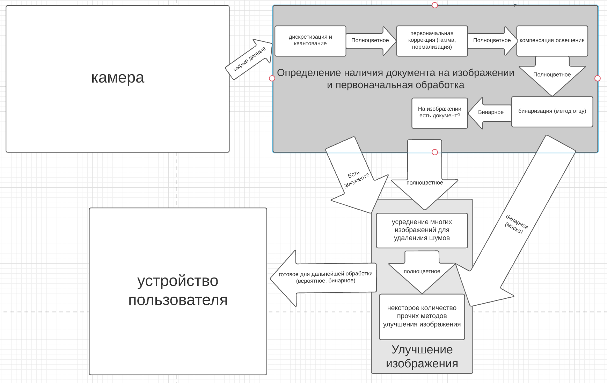
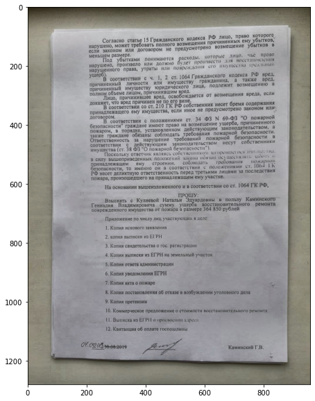
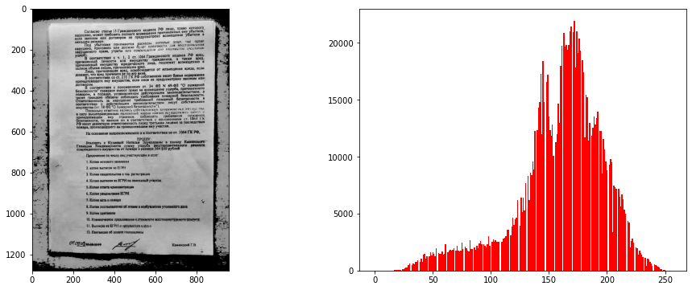
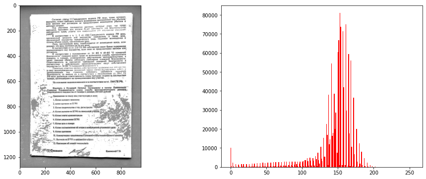

# Диссертация

# Структура проекта

Директории|Описание
:--:|:--:
**/img**               | изображения, используемые в этом проекте
**/materials**         | статьи и прочие материалы
**/mmcs_sfedu_thesis** | шаблон для диссертации
**/tex**               | разные латеховские файлы

## Цель

**Тема**: Разработка мобильного приложения для улучшения качества распознавания фотодокументов в затрудненных условиях съемки

## План

1. создание фотографий документа 
   - как это делается? 
2. предобработка изображений с целью увеличения качества изображения
3. восстановление документа из серии изображений
4. распознавание текста с привлечением с интеллектуальных методов обработки текста для восстановления потерянных фрагментов
5. (?) оценить уровень достоверности восстановленного фрагмента

## Ближайшее время

1. Анализ области + литература
   
   - [x] Что есть для предобработки изображений под FPGA? (ip ядра, алгоритмы, насколько это вообще доступно)
   - [ ] Конкретно про lattice прошлый пункт
   - [x] Запустить демку
   - [x] На чем писать под lattice?
   - [ ] использовать ядра lattice

# Мысли

1. В обработке изображения должен участвовать алгоритм CLAHE (адаптивная эквализация гистограммы)

   

2. Также хорошо себя показывает кусочно линейное преобразование (промежуток цвета загоняем в одно значения). Работает лучше отсечения по одной какой-то границе. Но остается задача подбора границ.

   

3. У полученных изображений нужно компенсировать освещенность, чтобы цвет документа был однородным. Можно перенять опыт из статьи ["Коррекция освещения в распознавании лиц.pdf"](materials/коррекция%20освещения%20в%20распознавании%20лиц.pdf). Алгоритм https://github.com/ofgulban/iphigen. На картинке видна разница с изображением из прошлого пункта. 

   

4. для выбора порога на первых этапах можно использовать метод Отцу (желательно, с компенсацией освещения)

5. для уменьшения шума можно воспользоваться усреднением изображений

## Вопросы

1. Будем моделировать методы? (макет на распберри, макет на пк без камеры и тд)
2. С чего начнем? С методов или с плисы?
3. Как организовать тестирование и отладку? плиса постоянно воткнута в монитор? сохраняет в память и передает на пк?
4. На какие риски надо ориентироваться?

## Предложения

1. Двигаться короткими итерациями через модификацию исходной демки
2. Использовать тесты (приходит обновление, она собирает куски проекта в специальном тестовом состоянии, загружает в память картинку, запускает обработку, сравнивает с ожидаемым результатом и находит отклонение)
   

## Этапы

#### Создание среды

1. Написан n проектов ради обучения VHDL 
2. Отключить одну камеру
3. Сделать камеру на весь экран
4. Реализовать сохранение изображения в память     ???
5. Научиться заменять камеру на память    ???
6. Написать тестовую систему    ???
7. Реализовать перевод в оттенки серого

#### Реализация пайплайна

8. Реализовать бинаризацию по заданному порогу
9.  Реализовать один из методов нахождения порогу (отсу)
10. Реализовать фильтрацию     ???
11. Реализовать интерполяцию   ???
12. Реализовать нормализацию гистограммы
13. Реализовать эквализацию (обычную или CLAHE)
14. Реализовать сегментацию изображения
15. Реализовать обнаружение присутствия документа в кадре 