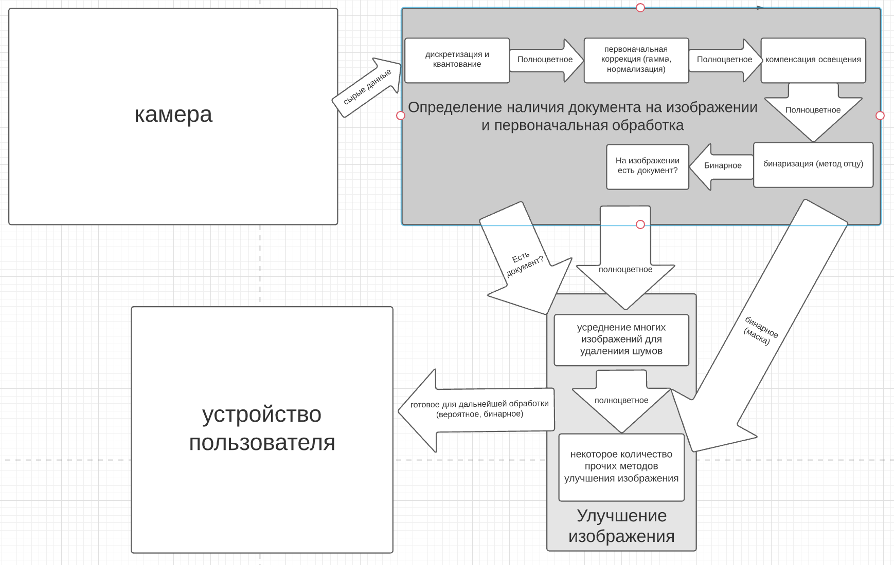
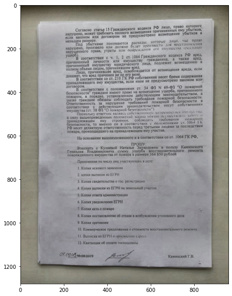

# Диссертация

## Цель

**Тема**: Разработка мобильного приложения для улучшения качества распознавания фотодокументов в затрудненных условиях съемки

## План

1. создание фотографий документа 
   - как это делается? 
2. предобработка изображений с целью увеличения качества изображения
3. восстановление документа из серии изображений
4. распознавание текста с привлечением с интеллектуальных методов обработки текста для восстановления потерянных фрагментов
5. (?) оценить уровень достоверности восстановленного фрагмента

## Ближайшее время

1. Анализ области + литература
   - Что есть для предобработки изображений под FPGA? (ip ядра, алгоритмы, насколько это вообще доступно)
   - Конкретно про lattice прошлый пункт
   - Запустить демку и использовать ядра lattice
   - На чем писать под lattice?

# Мысли

1. В обработке изображения должен участвовать алгоритм CLAHE (адаптивная эквализация гистограммы)

   

2. Также хорошо себя показывает кусочно линейное преобразование (промежуток цвета загоняем в одно значения). Работает лучше отсечения по одной какой-то границе. Но остается задача подбора границ.

   

3. У полученных изображений нужно компенсировать освещенность, чтобы цвет документа был однородным. Можно перенять опыт из статьи __"Коррекция освещения в распознавании лиц.pdf"__. Алгоритм https://github.com/ofgulban/iphigen. На картинке видна разница с изображением из прошлого пункта

   

4. для выбора порога можно использовать метод Отцу (желательно, с компенсацией освещения)
5. для уменьшения шума можно воспользоваться усреднением изображений